# Fur Fetch Pet Adoption Portal - System Architecture

## Overview
A full-stack MERN application for pet adoption with role-based access control, featuring public pet browsing, user application tracking, and admin review workflows.

---

## 🏗️ Three-Layer Architecture

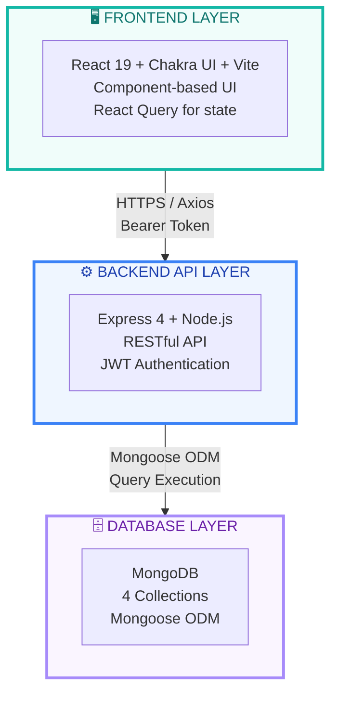

---

## 📱 Frontend Layer - React 19 + Chakra UI

### Component Hierarchy

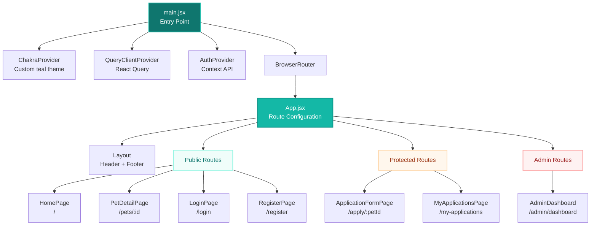

### Pages & Components

#### 📄 Public Pages
| Component | Route | Purpose |
|-----------|-------|---------|
| **HomePage** | `/` | Browse pets with filters (breed, age, size, location, urgent) |
| **PetDetailPage** | `/pets/:id` | View detailed pet information + adoption button |
| **LoginPage** | `/login` | User authentication form |
| **RegisterPage** | `/register` | New user account creation |

#### 🔒 Protected Pages (Authenticated Users)
| Component | Route | Purpose |
|-----------|-------|---------|
| **ApplicationFormPage** | `/apply/:petId` | Submit adoption application (Week 3 schema) |
| **MyApplicationsPage** | `/my-applications` | Track submitted applications with status updates |

#### 👑 Admin Pages (Admin Role Only)
| Component | Route | Purpose |
|-----------|-------|---------|
| **AdminDashboard** | `/admin/dashboard` | Review all applications, view statistics, update statuses |

#### 🧩 Core Components
- **AuthProvider** - Context API for global auth state (user, isAdmin, login, logout)
- **Layout** - Shared header/footer with navigation and auth controls
- **PetCard** - Reusable pet display card with Week 2 teal design
- **ProtectedRoute** - Route guard for authenticated users
- **AdminRoute** - Route guard for admin-only pages

### API Client Layer

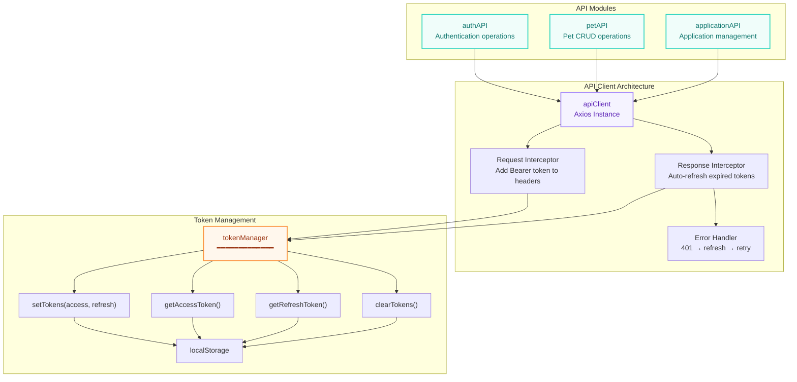

### State Management
| State Type | Solution | Location |
|------------|----------|----------|
| Server State | React Query | All API calls - caching, refetching |
| Auth State | Context API | AuthProvider - user info, login status |
| Local State | useState | Component forms, UI toggles |
| Form State | react-hook-form | Form validation & submission |

---

## ⚙️ Backend API Layer - Express 4 + Node.js

### API Endpoints

#### 🔑 Authentication Routes - `/api/auth`
```
POST   /api/auth/register
       ├─ Input: { username, email, password }
       ├─ Validation: Joi schema
       ├─ Process: Check duplicate → Hash password → Create user → Generate tokens
       └─ Output: { user, accessToken, refreshToken }

POST   /api/auth/login
       ├─ Input: { email, password }
       ├─ Validation: Joi schema
       ├─ Process: Find user → Compare hash → Generate tokens → Create session
       └─ Output: { user, accessToken, refreshToken }

POST   /api/auth/logout
       ├─ Middleware: verifyToken
       ├─ Process: Invalidate session
       └─ Output: { message: "Logged out successfully" }

POST   /api/auth/refresh
       ├─ Input: { refreshToken }
       ├─ Process: Verify token → Check session → Generate new tokens
       └─ Output: { accessToken, refreshToken }

GET    /api/auth/profile
       ├─ Middleware: verifyToken
       ├─ Process: Get user by ID from token
       └─ Output: { user }
```

#### 🐾 Pet Routes - `/api/pets`
```
GET    /api/pets
       ├─ Query Params: breed, age, size, location, urgent, search
       ├─ Middleware: None (public)
       ├─ Process: Filter pets + text search
       └─ Output: { pets[], total, filters }

GET    /api/pets/:id
       ├─ Middleware: None (public)
       ├─ Process: Find pet by ID
       └─ Output: { pet }

POST   /api/pets
       ├─ Middleware: verifyToken, isAdmin
       ├─ Input: Pet object (Week 2 schema)
       ├─ Validation: Joi schema
       └─ Output: { pet }

PUT    /api/pets/:id
       ├─ Middleware: verifyToken, isAdmin
       ├─ Input: Updated pet fields
       └─ Output: { pet }

DELETE /api/pets/:id
       ├─ Middleware: verifyToken, isAdmin
       ├─ Process: Soft delete (set isActive: false)
       └─ Output: { message }
```

#### 📋 Application Routes - `/api/applications`
```
POST   /api/applications
       ├─ Middleware: verifyToken
       ├─ Input: Application form (Week 3 schema)
       ├─ Validation: Joi schema
       ├─ Process: Check pet available → Check no duplicate pending → Create app
       └─ Output: { application }

GET    /api/applications
       ├─ Middleware: verifyToken
       ├─ Process: Get user's applications with pet details
       └─ Output: { applications[] }

GET    /api/applications/admin/all
       ├─ Middleware: verifyToken, isAdmin
       ├─ Query Params: status (all|pending|approved|rejected)
       ├─ Process: Get all applications with user + pet details
       └─ Output: { applications[], total }

GET    /api/applications/admin/stats
       ├─ Middleware: verifyToken, isAdmin
       ├─ Process: Aggregate statistics
       └─ Output: { total, pending, approved, rejected }

PUT    /api/applications/:id
       ├─ Middleware: verifyToken, isAdmin
       ├─ Input: { status, adminNotes }
       ├─ Process: Update application
       └─ Output: { application }

DELETE /api/applications/:id
       ├─ Middleware: verifyToken, isAdmin
       ├─ Process: Hard delete application
       └─ Output: { message }
```

### Middleware Chain

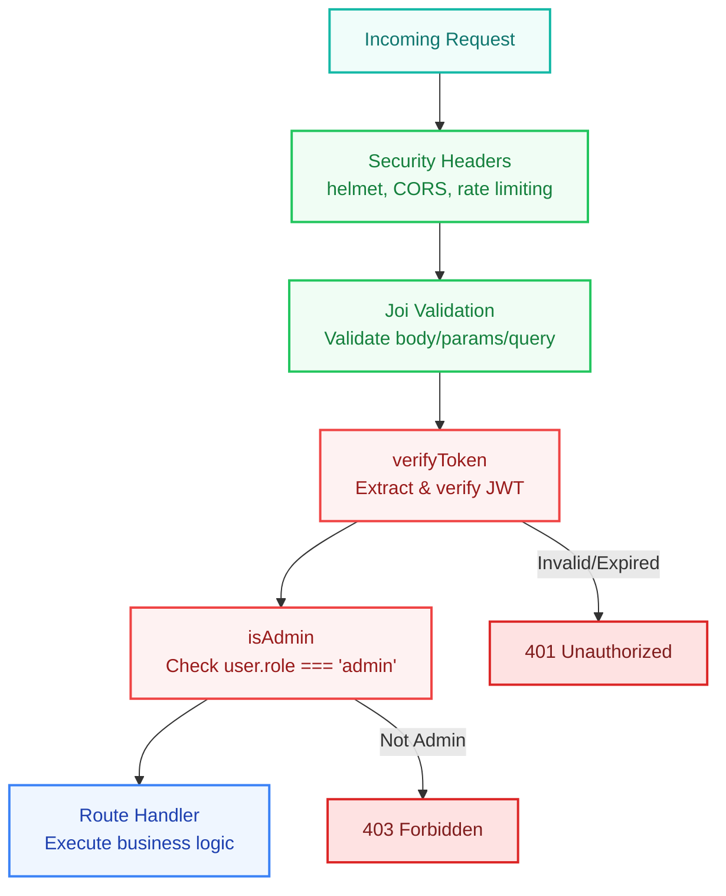

### JWT Token System

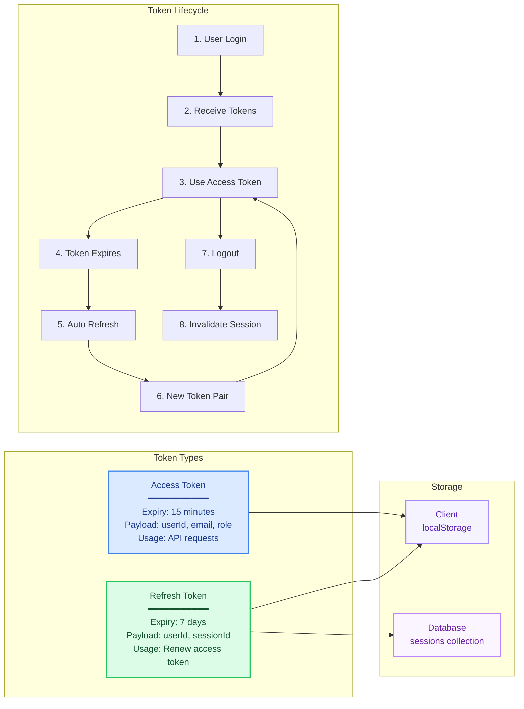

### Security Features

| Feature | Implementation | Purpose |
|---------|----------------|---------|
| **Password Hashing** | bcrypt (12 rounds) | Secure password storage |
| **JWT Authentication** | Access + Refresh tokens | Stateless auth with auto-renewal |
| **Role-Based Access** | User.role (user/admin) | Admin-only endpoints |
| **Input Validation** | Joi schemas | Prevent malformed data |
| **Rate Limiting** | express-rate-limit | 100 requests/hour per IP |
| **Security Headers** | helmet | XSS, clickjacking protection |
| **CORS** | cors middleware | Cross-origin request control |
| **Soft Deletes** | isActive flag | Data preservation |

---

## 🗄️ Database Layer - MongoDB + Mongoose

### Collections Schema

#### 1️⃣ **users** Collection
```javascript
{
  _id: ObjectId,
  username: String (unique, required),
  email: String (unique, required),
  passwordHash: String (required),
  role: String (enum: ['user', 'admin'], default: 'user'),
  favoritePets: [ObjectId] (ref: 'Pet'),
  isActive: Boolean (default: true),
  createdAt: Date,
  updatedAt: Date
}

Indexes:
  - email (unique)
  - username (unique)
  - isActive
```

#### 2️⃣ **sessions** Collection
```javascript
{
  _id: ObjectId,
  userId: ObjectId (ref: 'User', required),
  refreshToken: String (unique, required),
  deviceInfo: String,
  expiresAt: Date (required),
  isActive: Boolean (default: true),
  createdAt: Date
}

Indexes:
  - refreshToken (unique)
  - userId
  - expiresAt
```

#### 3️⃣ **pets** Collection
```javascript
{
  _id: ObjectId,
  name: String (required),
  petType: String (enum: ['dog', 'cat', 'other'], required),
  breed: String (required),
  age: Number (months, required),
  size: String (enum: ['small', 'medium', 'large']),
  gender: String (enum: ['male', 'female']),
  location: String (required),
  description: String,
  images: [String] (URLs),
  healthStatus: String,
  isUrgent: Boolean (default: false),
  isAvailable: Boolean (default: true),
  ownerId: ObjectId (ref: 'User'), // admin who created listing
  isActive: Boolean (default: true),
  createdAt: Date,
  updatedAt: Date
}

Indexes:
  - petType
  - isAvailable
  - isActive
  - location + breed + name (text index for search)
```

#### 4️⃣ **applications** Collection
```javascript
{
  _id: ObjectId,
  applicantId: ObjectId (ref: 'User', required),
  petId: ObjectId (ref: 'Pet', required),
  
  // Week 3 Schema Fields
  fullName: String (required),
  email: String (required),
  phone: String (required),
  address: String (required),
  housingType: String (enum: ['house', 'apartment', 'other']),
  hasYard: Boolean,
  householdMembers: Number,
  hasChildren: Boolean,
  childrenAges: String,
  hasPets: Boolean,
  currentPets: String,
  experience: String,
  reason: String (required),
  
  // Admin fields
  status: String (enum: ['pending', 'approved', 'rejected'], default: 'pending'),
  adminNotes: String,
  submittedDate: Date (default: Date.now),
  lastUpdated: Date,
  reviewedBy: ObjectId (ref: 'User'),
  
  isActive: Boolean (default: true)
}

Indexes:
  - applicantId
  - petId
  - status
  - submittedDate (descending)

Unique Constraint:
  - One pending application per (applicantId, petId) pair
```

### Database Relationships

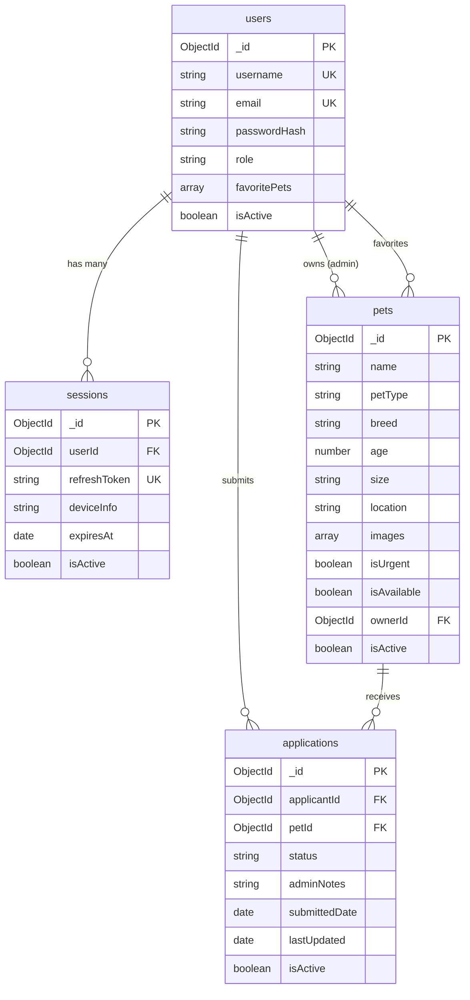

### Query Optimization

```sql
-- Most frequent queries and their indexes:

1. User Login
   Query: users.findOne({ email: "..." })
   Index: users.email (unique)

2. Pet Filtering
   Query: pets.find({ 
     petType: "dog", 
     isAvailable: true, 
     location: { $regex: "..." } 
   })
   Indexes: 
     - pets.petType
     - pets.isAvailable
     - pets TEXT (location + breed + name)

3. My Applications
   Query: applications.find({ applicantId: userId })
           .populate('petId')
           .sort({ submittedDate: -1 })
   Index: applications.applicantId

4. Admin Dashboard
   Query: applications.find({ status: "pending" })
           .populate('applicantId petId')
           .sort({ submittedDate: -1 })
   Index: applications.status

5. Token Refresh
   Query: sessions.findOne({ refreshToken: "..." })
   Index: sessions.refreshToken (unique)
```

---

## 🔄 Data Flow Examples

### 1. User Registration Flow

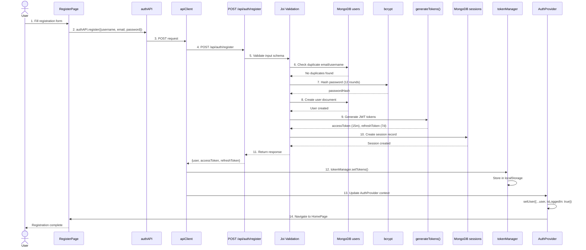

### 2. Pet Browsing with Filters Flow

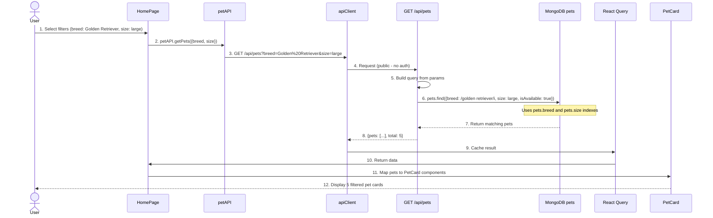

### 3. Adoption Application Submission Flow

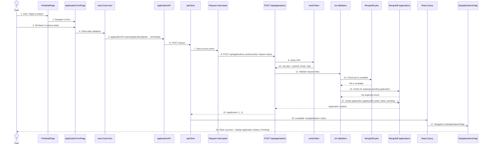

### 4. Admin Application Review Flow

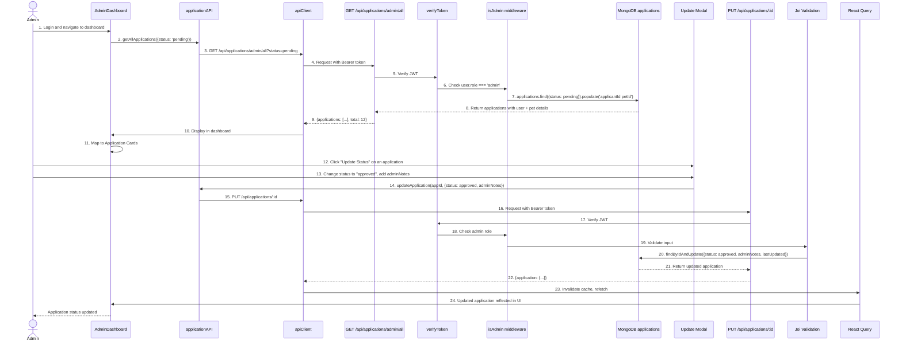

### 5. Token Refresh Flow (Automatic)

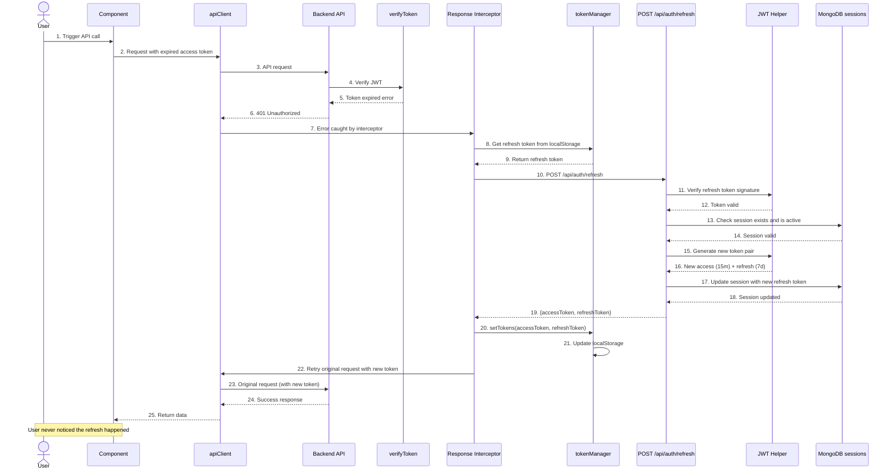

---

## 🎨 UI Design System (Week 2 Inspired)

### Color Palette - Teal Theme

```css
/* Primary Teal Colors */
--teal-50:  #f0fdfa;  /* Light backgrounds */
--teal-100: #ccfbf1;  /* Borders, footer background */
--teal-500: #14b8a6;  /* Primary - header, buttons, headings */
--teal-600: #0d9488;  /* Hover states */
--teal-700: #0f766e;  /* Active/dark accents */

/* Usage */
Header Background:      teal.500
Footer Background:      teal.50
Primary Buttons:        colorPalette="teal"
Card Borders:           teal.100
Headings:               teal.600
Accent Elements:        teal.500-700
```

### Component Styling

```css
/* Card Design */
border-radius: 25px
padding: 22px
box-shadow: 0 10px 30px rgba(13, 148, 136, 0.15)
hover: translateY(-10px) scale(1.02)

/* Grid Layout */
max-width: 1400px
grid-template-columns: repeat(auto-fill, minmax(280px, 1fr))
gap: 30px

/* Typography */
Header: 3em (Segoe UI, Poppins)
Pet Name: 1.5em (bold)
Body: 1em-1.2em
```

---

## 🔐 Security Model Summary

| Layer | Security Feature | Implementation |
|-------|-----------------|----------------|
| **Frontend** | Token Storage | localStorage with automatic injection |
| **Frontend** | Auto Refresh | Interceptor handles expired tokens transparently |
| **Frontend** | Protected Routes | React Router guards check authentication |
| **Backend** | Password Security | bcrypt hashing with 12 salt rounds |
| **Backend** | JWT Authentication | Access (15m) + Refresh (7d) token pair |
| **Backend** | Authorization | Role-based access control (user/admin) |
| **Backend** | Input Validation | Joi schemas on all POST/PUT routes |
| **Backend** | Rate Limiting | 100 requests/hour per IP |
| **Backend** | Security Headers | Helmet (XSS, clickjacking protection) |
| **Backend** | CORS | Configured for specific origins |
| **Database** | Soft Deletes | isActive flag preserves data integrity |
| **Database** | Unique Constraints | Prevent duplicate emails, usernames, sessions |
| **Database** | Indexes | Optimized queries, prevent full scans |

---

## 📊 Technology Stack Summary

### Frontend Stack
```
├── React 19.1           → UI library
├── Vite 7.0             → Build tool
├── Chakra UI 3.24       → Component library
├── React Query 5.83     → Server state management
├── React Router 7.7     → Client-side routing
├── Axios 1.11           → HTTP client
├── react-hook-form 7.62 → Form handling
└── ES6 Modules          → Modern JavaScript
```

### Backend Stack
```
├── Node.js              → Runtime
├── Express 4.21         → Web framework
├── Mongoose 8.0         → MongoDB ODM
├── jsonwebtoken 9.0     → JWT authentication
├── bcryptjs 2.4         → Password hashing
├── Joi 17.11            → Input validation
├── helmet 7.1           → Security headers
├── cors 2.8             → CORS middleware
├── express-rate-limit   → Rate limiting
└── CommonJS             → Module system
```

### Database
```
MongoDB
├── users collection
├── sessions collection
├── pets collection
└── applications collection
```

---

## 📝 Key Implementation Notes

### Critical API Path Fix (2026-02-05)
⚠️ **All frontend API endpoints MUST include `/api` prefix:**
- ✅ Correct: `GET /api/pets`
- ❌ Wrong: `GET /pets`

**Files requiring `/api` prefix:**
- `client/src/api/pet.js` - All endpoints
- `client/src/api/application.js` - All endpoints
- `client/src/api/auth.js` - Already correct (reference)

### Route Ordering (Critical)
In `server/routes/application.js`, admin routes MUST come before `:id` routes:
```javascript
// ✅ Correct order
router.get('/admin/all', verifyToken, isAdmin, handler)
router.get('/admin/stats', verifyToken, isAdmin, handler)
router.get('/:id', verifyToken, handler)  // Must be last

// ❌ Wrong - /:id catches /admin/all
router.get('/:id', verifyToken, handler)
router.get('/admin/all', verifyToken, isAdmin, handler)
```

### AuthProvider isAdmin
Changed from function to memoized value:
```javascript
// ✅ Correct usage
const { isAdmin } = useAuth()
if (isAdmin) { ... }

// ❌ Wrong usage (old)
if (isAdmin()) { ... }
```

---

## 🚀 Future Enhancements (Optional)

- Favorites system (backend ready, frontend not implemented)
- Image upload for pets (currently uses URLs)
- Email notifications for application status changes
- Search history tracking
- Advanced analytics dashboard
- Real-time updates with WebSockets
- Pet recommendation system based on user preferences
- Export applications to PDF
- Calendar integration for adoption appointments


